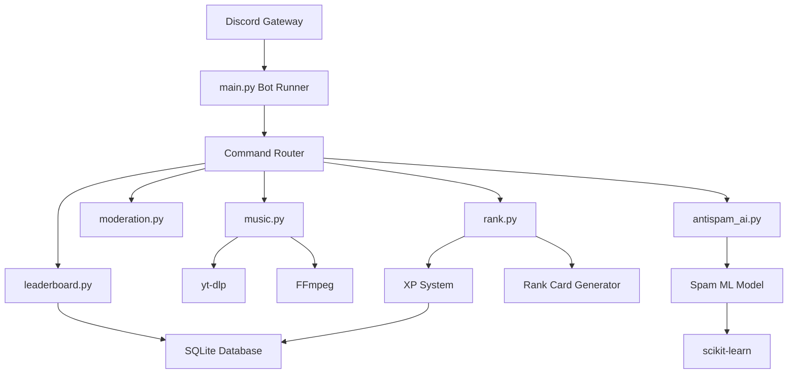

# 🤖 Discord AI Utility Bot


> A modern, scalable **Discord utility bot** featuring a powerful
> **music system, AI spam detection, leveling system, and moderation
> tools** --- built with clean architecture and designed for large
> communities.

------------------------------------------------------------------------

# ✨ Overview

Discord AI Utility Bot is a modular Discord bot built using
**discord.py** with a focus on:

-   ⚡ Performance
-   🧩 Modular architecture
-   🧠 Intelligent moderation
-   🎵 High‑quality music playback
-   🏆 Community engagement systems

The project is structured similarly to production-grade open‑source bots
and can scale to **large Discord servers**.

------------------------------------------------------------------------

# 🚀 Key Features

## 🎵 Advanced Music System

Powerful queue-based music system with playlist support.

Features:

-   YouTube search
-   Playlist support
-   Song queue
-   Loop / shuffle
-   Autoplay
-   Now playing embeds
-   Voice channel auto management

Example commands:

    !play <song or url>
    !queue
    !skip
    !stop
    !shuffle
    !loop
    !autoplay
    !nowplaying
    !leave

------------------------------------------------------------------------

## 🏆 Leveling & Rank System

Community engagement system inspired by popular Discord bots.

Features:

-   XP per message
-   Automatic leveling
-   Rank cards
-   Server leaderboard
-   Persistent storage

Commands:

    !rank
    !leaderboard

------------------------------------------------------------------------

## 🤖 AI Spam Detection

Built-in spam detection powered by machine learning.

Pipeline:

Message → Preprocessing → Vectorization → Classification → Moderation

Detects:

-   Scam links
-   Nitro scams
-   Advertisement spam
-   Repeated messages

Automated actions:

-   Delete message
-   Warn user
-   Log event

------------------------------------------------------------------------

## 🛠 Moderation Tools

Essential moderation commands for community management.

    !ban
    !kick
    !timeout
    !clear

------------------------------------------------------------------------

# 🧠 System Architecture

The bot follows a **layered modular architecture** to keep components
isolated and maintainable.

    Presentation Layer
            │
            ▼
    Command Layer (Discord Cogs)
            │
            ▼
    Service Layer
            │
            ▼
    Data Layer

------------------------------------------------------------------------

# 🧩 Architecture Diagram



------------------------------------------------------------------------

# 📂 Project Structure

    discord-ai-bot/
    │
    ├── main.py
    │
    ├── cogs/
    │   ├── music.py
    │   ├── moderation.py
    │   ├── rank.py
    │   ├── leaderboard.py
    │   └── antispam_ai.py
    │
    ├── utils/
    │   ├── database.py
    │   ├── embeds.py
    │   ├── xp_system.py
    │   └── spam_model.py
    │
    ├── data/
    │   ├── levels.db
    │   └── spam_dataset.csv
    │
    ├── requirements.txt
    └── README.md

------------------------------------------------------------------------

# ⚡ Quick Start

## 1. Clone the repository

    git clone (https://github.com/vdbk-1311/Discord-Utility-Bot)
    cd Discord-Utility-Bot

------------------------------------------------------------------------

## 2. Install dependencies

    pip install -r requirements.txt

------------------------------------------------------------------------

## 3. Install FFmpeg

Required for the music system.

Linux:

    sudo apt install ffmpeg

Windows:

Download from:

https://ffmpeg.org/download.html

------------------------------------------------------------------------

## 4. Configure environment variables

Create `.env`

    DISCORD_TOKEN=your_bot_token_here

------------------------------------------------------------------------

## 5. Run the bot

    python main.py

------------------------------------------------------------------------

# ⚙️ Configuration

Example `config.json`

``` json
{
  "prefix": "!",
  "xp_per_message": 5,
  "spam_threshold": 0.8
}
```

------------------------------------------------------------------------

# 📊 Performance

Typical usage:

  Component         Resource Usage
  ----------------- ----------------
  Music streaming   Low CPU
  Spam model        \<50MB RAM
  Database          SQLite
  Idle bot          \~80MB RAM

Runs smoothly on:

-   VPS 1GB RAM
-   Raspberry Pi
-   Small cloud instance

------------------------------------------------------------------------

# 🧪 Development

Run in development mode:

    python main.py --dev

------------------------------------------------------------------------

# 🗺 Roadmap

Future improvements:

-   Lavalink music system
-   Slash command support
-   Web dashboard
-   Redis caching
-   Docker deployment
-   Advanced AI moderation
-   Economy system

------------------------------------------------------------------------

# 🤝 Contributing

Contributions are welcome.

1.  Fork the repository
2.  Create a feature branch
3.  Commit changes
4.  Open a pull request

------------------------------------------------------------------------

# 🔐 Security

If you discover a vulnerability, please open an issue or contact the
maintainers.

------------------------------------------------------------------------

# 📜 License

MIT License

------------------------------------------------------------------------

# ⭐ Support the Project

If you like this project:

⭐ Star the repository\
🍴 Fork the project\
🛠 Contribute features
